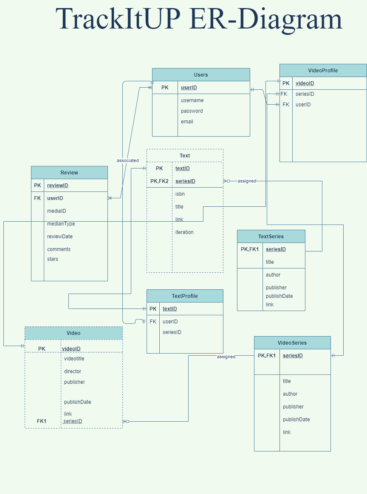
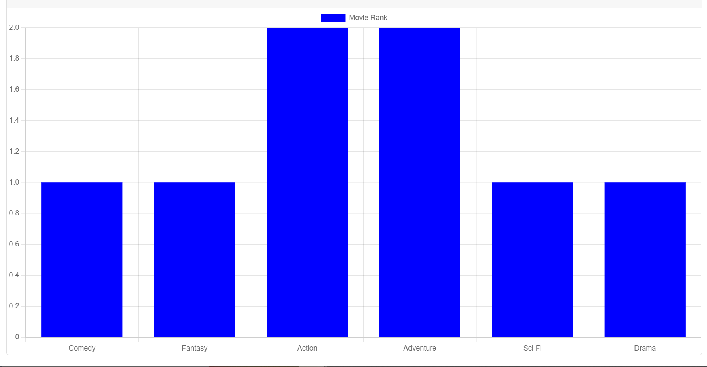

# TrackItUp

* [TrackItUp](#trackitup)
* [Mission](#mission)
* [Goals](#goals)
* [Team Members & Responsibilities](#team-members-&-responsibilities)
* [Code snippets of interaction with RESTFul API](#code-snippets-of-interaction-with-restful-api)
* [Tools](#tools)
* [Resources](#resources)
* [Website URL](#website-url)
* [ER Diagram](#er-diagram)
* [Set Up and Run](#set-up-and-run)
* [Run Development Server](#how-to-build-/-run-development-server)
* [Run Production Server](#how-to-build-/-run-production-server)
* [Charting](#charting)

## Mission

There are too many streaming apps and media apps. We wanted an easy way to track all of the media we consume. 

## Goals

- This app will allow users enter media forms that they are interested.
- They will also be able to track media as it updates.

## Team Members & Responsibilities
1. **Will Bedu**
- Responsibilities:
 Frontend, Backend, Testing, Security, CI/CD, Infrastructure, and Submissions

2. **Yashwanth Reddy Thadisina**
- Responsibilities:
 Frontend, Backend, Testing

3. **Monisha Suthapalli**
- Responsibilities:
Frontend, Backend, Database diagrams, Docker

## Code snippets of interaction with RESTFul API

**IMDB API Call** 
```
const moviedataurl = `https://imdb-api.com/en/API/Title/${api-key}/${movieId}`
const moviedata = await axios.get(moviedataurl)
```

## Tools
- [VSCode](https://vscode.dev/) Editor
- [Git](https://git-scm.com/) for version control
- [Postman](https://www.postman.com/) for Testing

## Resources

- [Node.js](https://nodejs.org/en/)
- [Express.js](https://expressjs.com/)
- [Handlebars](https://handlebarsjs.com/)
- [Passport.js](http://www.passportjs.org/)
- [Sqlite3](https://www.npmjs.com/package/sqlite3)
- [Docker](https://www.docker.com/) 

## Website URL
[https://trackitup.net](https://trackitup.net/login)

## ER Diagram


## Set Up and Run

## How to Build / Run Development Server
```bash
#clone repository

git clone https://github.com/UIC-CS484/assignment-2---final-project-repository-team17.git
cd assignment-2---final-project-repository-team17

## Install dependencies

npm i

## run dev Server

nodemon npm start
```

## How to Build / Run Production Server
```bash
#clone repository

git clone https://github.com/UIC-CS484/assignment-2---final-project-repository-team17.git
cd assignment-2---final-project-repository-team17

## Install dependencies

npm i

## run dev Server

NODE_ENV=production node ./bin/www
```

## Charting
Chart is generated using data from [imdb-api.com](imdb-api.com) while using [chart.js](https://www.chartjs.org/docs/latest/) to render the chart

This chart shows the movies which the user watches and categorizes them based on genres.


